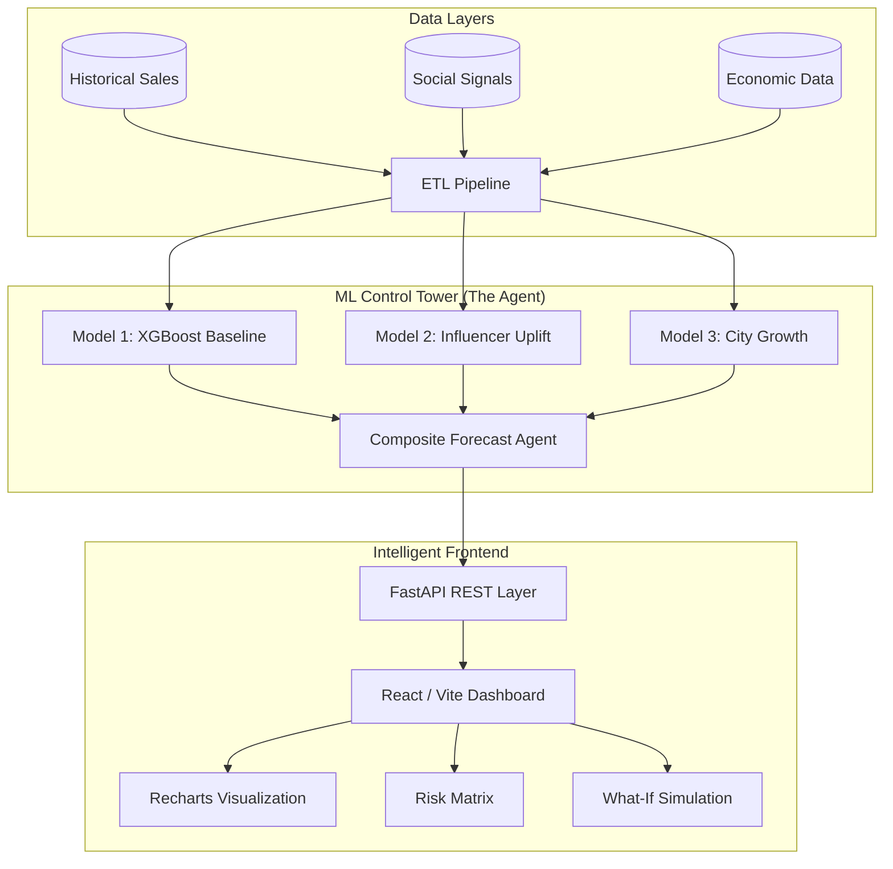

# 🚀 Control Tower: AI-Driven Supply Chain Intelligence

[](https://github.com/studentanush/Cummins_Hackathon)
[](https://github.com/studentanush/Cummins_Hackathon)

**Control Tower** is a state-of-the-art supply chain analytics platform designed for the modern retail landscape. By fusing traditional baseline demand with real-time influencer signals and city-level economic growth indicators, it provides a high-fidelity "Control Tower" view of inventory risks and demand surges.

---

## 💎 The Problem & Our Solution

Traditional supply chain models often fail to capture **short-term volatility** (influencer surges) and **localized economic shifts** (city-level growth). 

**Our Innovation:** A modular **3-Model Pipeline** that aggregates:
1.  **Macro Baseline**: Long-term seasonality and trend (XGBoost).
2.  **Influencer Pulse**: Hyper-local demand spikes triggered by social media marketing (Multi-target Regressors).
3.  **City Dynamics**: External economic indicators like income velocity and housing affordability (LightGBM).

---

## 🏗️ Technical Architecture



---

## 🚀 Getting Started

### 1. Prerequisites
- **Python 3.10+**
- **Node.js 18+**
- **Modern Browser** (Chrome/Edge recommended)

### 2. Environment Setup
```bash
# Clone the repository
git clone https://github.com/studentanush/Cummins_Hackathon.git
cd Cummins_Hackathon

# Initialize data and train models
python scripts/conti_script.py
python scripts/model1_script.py
python scripts/seed_and_train_influencer_demo.py
python scripts/build_case_study_tables.py
```

### 3. Launch Services
**Backend (FastAPI):**
```bash
cd backend
python -m venv .venv
# Windows: .venv\Scripts\activate | Linux: source .venv/bin/activate
pip install -r requirements.txt
python -m uvicorn app.main:app --reload
```

**Frontend (React + Vite):**
```bash
cd frontend
npm install
npm run dev
```


## 🛠️ Feature Showcase

### 🔮 High-Fidelity Forecasting Agent
Combines the 3-model pipeline to predict daily demand with granular precision. Includes a **decay-aware lift curve** for influencer campaigns, allowing buyers to see exactly how demand will taper over 96 hours.

### ⚠️ Unified Risk Register
A proactive inventory monitor that flags SKUs for **Stockout** or **Overstock** based on lead-time demand volatility and current inventory levels.

### 🧪 Model-Driven What-If Simulations
Simulate real-world scenarios (e.g., "What if this influencer campaign reaches 1M followers?") and see the immediate impact on inventory drawdown over a 14-day horizon.

---

## 📂 Project Structure

| Directory | Description |
| :--- | :--- |
| `backend/` | FastAPI application, ML inference logic, and API endpoints. |
| `frontend/` | React/TypeScript dashboard with Tailwind CSS and Framer Motion. |
| `notebooks/` | Research & development Jupyter notebooks for ML models. |
| `scripts/` | Data engineering, seeding, and model training utilities. |
| `models/` | Serialized model artifacts (.pkl). |
| `data/` | Raw and engineered datasets (CSV).  |

---

## 🔮 Strategic Roadmap

As we continue to scale the Control Tower platform for enterprise supply chains, our immediate focus areas include:

- [ ] **Generative AI Orchestration**: Integrating advanced LLMs to replace rule-based heuristics with narrative, actionable insights on demand drivers and risk mitigation.
- [ ] **Enterprise MLOps**: Migrating the 3-model training pipeline to a managed cloud environment for automated retraining and endpoint deployment.
- [ ] **Embedded Business Intelligence**: Integrating deep, interactive BI dashboards for executive-level reporting and cross-functional visibility.
- [ ] **Cloud-Native Data Warehousing**: Transitioning from flat-file storage to a highly scalable, columnar data warehouse to support real-time analytics across millions of SKUs.

---
*Built for the future of intelligent supply chain management.*
